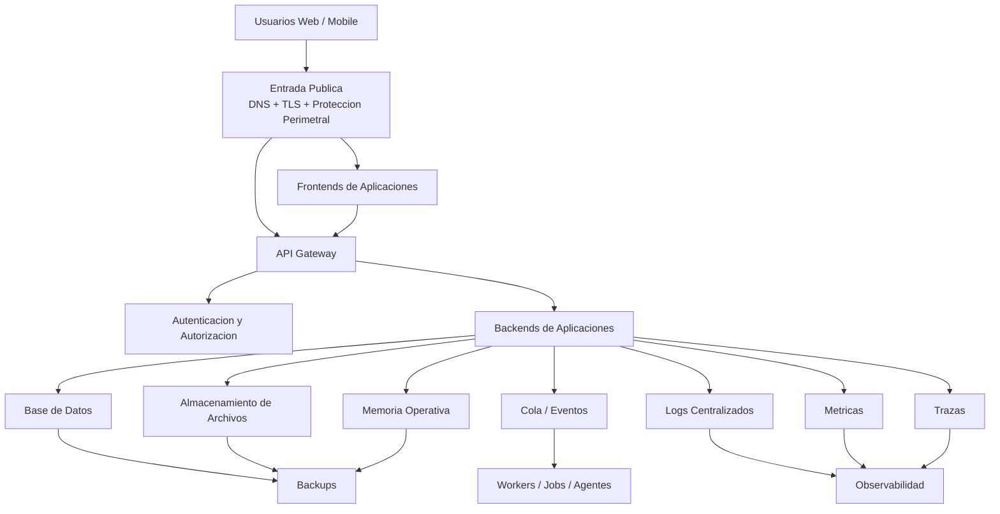
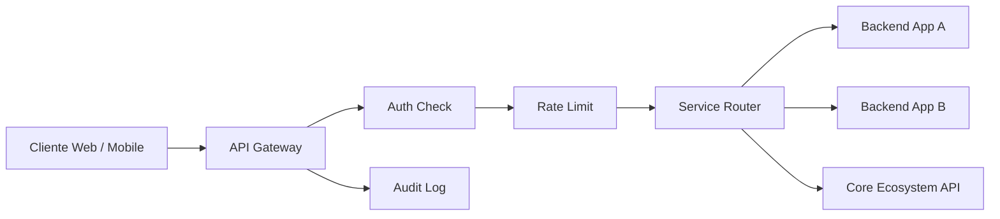
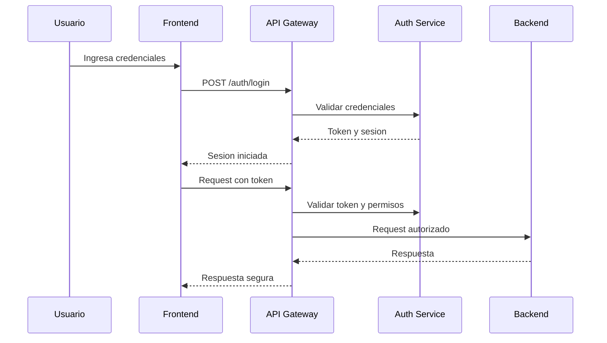
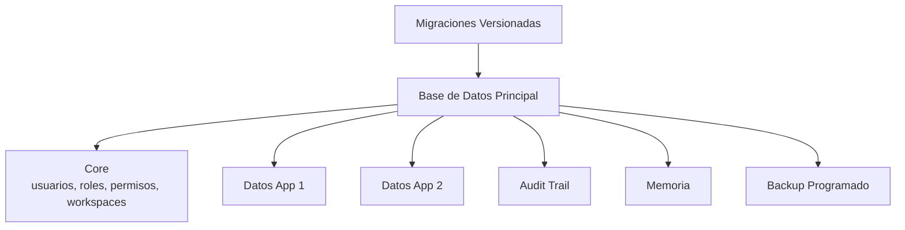
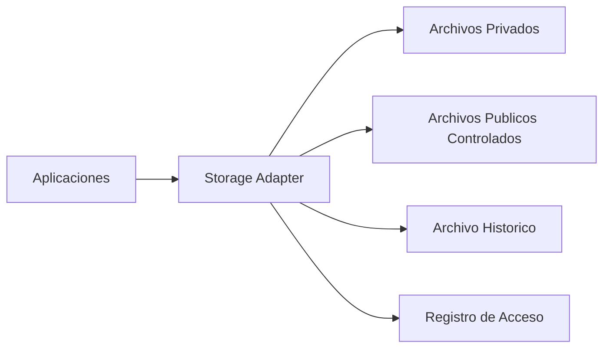
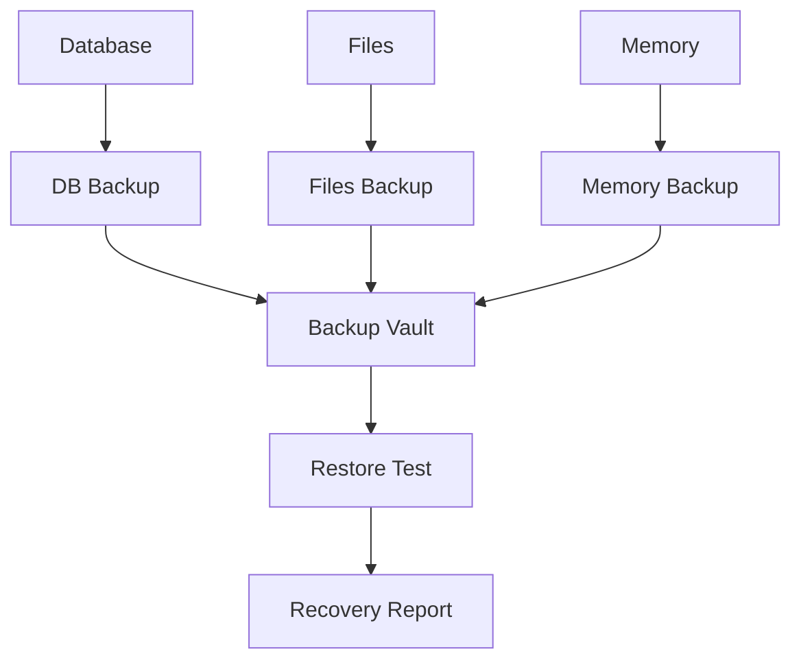
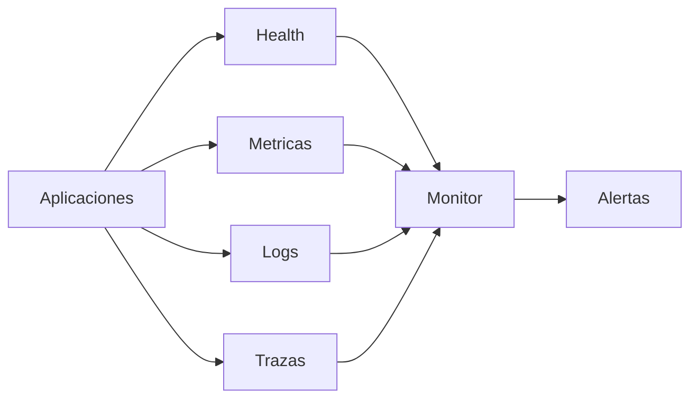
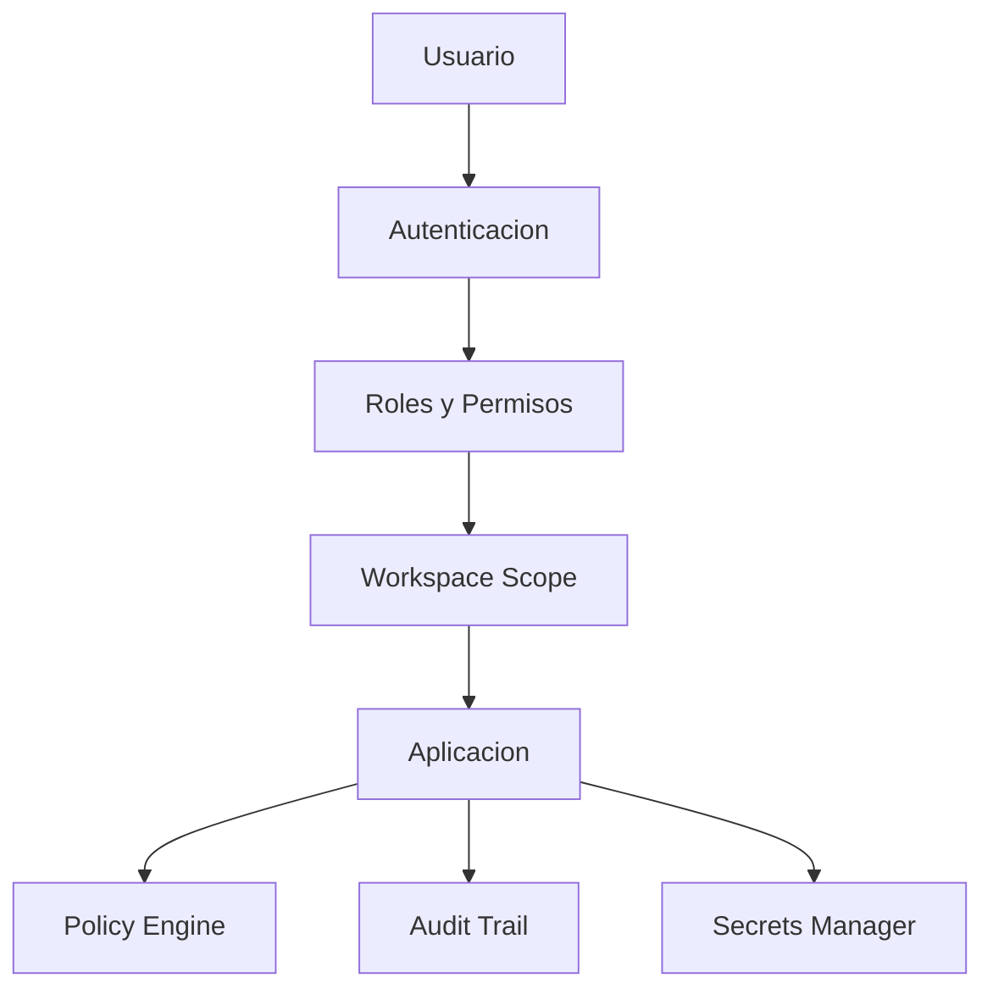
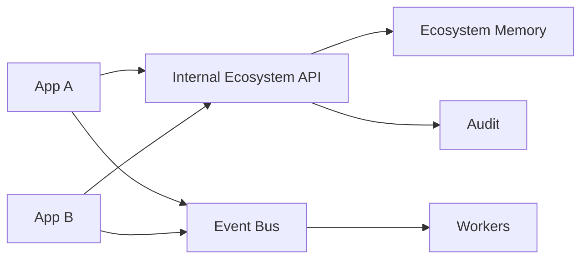

# 01 - Infrastructure Foundation

Estado: `FOUNDATION_REFERENCE`

Documento anterior: ninguno  
Documento siguiente: [02_ECOSYSTEM_CLOUD_ARCHITECTURE.md](./02_ECOSYSTEM_CLOUD_ARCHITECTURE.md)

## 1. Objetivo

Definir la base cloud-agnostic donde viviran todas las aplicaciones futuras del ecosistema, sin crear infraestructura real, sin hacer deploy y sin fijar un proveedor definitivo.

Esta fundacion debe permitir que cada aplicacion tenga independencia operacional, pero consuma servicios comunes de identidad, seguridad, datos, observabilidad, archivos, auditoria y comunicacion.

## 2. Principios

1. Cloud-agnostic primero.
2. Seguridad por defecto.
3. Separacion clara entre frontend, backend, datos, archivos, logs y secretos.
4. Toda app debe tener health, readiness, runtime/status, logs y backups si persiste datos.
5. Ninguna app debe depender de rutas locales de una maquina.
6. Ninguna app debe exponer secrets en frontend, repositorio, logs o reportes.
7. Las integraciones entre apps deben tener contratos explicitos.
8. La base inicial debe ser simple, pero preparada para escalar.

## 3. Arquitectura General



## 4. API Gateway

El API Gateway sera la puerta logica para las APIs publicas y semipublicas.

Responsabilidades:

- routing por aplicacion y version;
- validacion de autenticacion;
- rate limiting;
- CORS controlado;
- trazabilidad con request_id;
- bloqueo de rutas internas;
- normalizacion de errores;
- separacion entre APIs publicas e internas.



Reglas minimas:

- rutas publicas declaradas explicitamente;
- rutas autenticadas con token valido;
- rutas administrativas con permisos elevados;
- errores sin stack traces ni secrets;
- limites por IP, usuario y token.

## 5. Autenticacion

La autenticacion debe ser compartida por el ecosistema.

Capacidades minimas:

- login;
- logout;
- registro;
- recuperacion de acceso;
- sesion;
- token;
- roles;
- permisos;
- workspace;
- organizacion o empresa;
- auditoria de accesos.



Reglas:

- no admin default inseguro;
- no password hardcodeado;
- tokens con expiracion;
- sesiones revocables;
- permisos validados en backend;
- frontend nunca como unica barrera.

## 6. Base de Datos

La base de datos debe soportar:

- datos transaccionales por aplicacion;
- datos compartidos del ecosistema;
- auditoria;
- configuracion no secreta;
- memoria operativa persistente cuando aplique.

Estrategia inicial:

- base relacional administrada o equivalente;
- separacion logica por schema, prefijo o base por app;
- migraciones versionadas;
- backups automaticos;
- conexion cifrada;
- usuarios con permisos minimos.



## 7. Almacenamiento de Archivos

Uso:

- entregables;
- reportes;
- documentos;
- evidencias;
- adjuntos;
- exportaciones;
- archivos historicos.



Reglas:

- no guardar archivos finales solo en disco efimero;
- archivos privados con autorizacion;
- links temporales con expiracion;
- metadata minima por archivo;
- hash para evidencias importantes.

## 8. Logs

Los logs deben ser estructurados y centralizados.

Formato minimo:

```json
{
  "timestamp": "ISO-8601",
  "level": "info|warn|error",
  "service": "application-name",
  "environment": "local|staging|production",
  "request_id": "uuid",
  "user_id": "optional",
  "workspace_id": "optional",
  "event": "event.name",
  "message": "summary"
}
```

Prohibido registrar:

- API keys;
- passwords;
- tokens completos;
- secrets;
- credenciales externas;
- documentos sensibles completos;
- datos financieros o tributarios sin mascara.

## 9. Backups

Alcance:

- base de datos;
- archivos;
- memoria operativa;
- configuracion no secreta;
- entregables;
- auditoria.



Politica minima:

- backup diario;
- retencion configurable;
- restore periodico;
- cifrado;
- alerta ante fallo;
- separacion entre runtime y backup.

Objetivo inicial:

- RPO: 24 horas.
- RTO: 8 horas para apps criticas.

Objetivo a 3 anos:

- RPO menor a 1 hora para servicios criticos.
- RTO menor a 1 hora para servicios criticos.

## 10. Monitoreo y Observabilidad

Endpoints esperados:

- `/health`
- `/readiness`
- `/runtime/status`
- `/version`



Debe poder responder:

- que paso;
- cuando paso;
- quien fue afectado;
- que servicio fallo;
- que dependencia estaba degradada;
- que request lo causo.

## 11. Seguridad

Controles minimos:

- TLS obligatorio;
- secrets fuera de repositorio;
- gestor de secretos o variables seguras;
- RBAC;
- permisos por workspace;
- validacion backend;
- CORS restrictivo;
- rate limiting;
- sanitizacion;
- auditoria de acciones criticas;
- rotacion de credenciales;
- menor privilegio.



## 12. Comunicacion Entre Aplicaciones

Mecanismos permitidos:

1. API Gateway para cliente a backend.
2. APIs internas para backend a backend.
3. Eventos para trabajo asincronico.
4. Memoria operativa para contexto compartido.
5. Webhooks internos para notificaciones.



## 13. Estrategia Multiaplicacion

Cada aplicacion debe tener:

- owner;
- frontend;
- backend;
- health;
- runtime/status;
- variables declaradas;
- logs;
- permisos;
- documentacion API;
- estrategia de datos;
- estrategia de archivos;
- backup si persiste datos;
- smoke test;
- rollback documentado.

## 14. Escalamiento Inicial

Horizonte: 0 a 6 meses.

Base:

- frontends como servicios estaticos o equivalentes;
- backends como servicios web;
- base de datos persistente;
- storage persistente;
- secrets por entorno;
- logs basicos;
- backups automaticos;
- monitoreo de uptime;
- cola simple si es necesaria.

## 15. Escalamiento a 3 Anos

Horizonte: 1 a 3 anos.

Evolucion:

- API Gateway maduro;
- autenticacion centralizada robusta;
- aislamiento por tenant;
- bases separadas para apps criticas;
- eventos como columna vertebral;
- workers especializados;
- observabilidad end-to-end;
- CI/CD por aplicacion;
- staging y produccion separados;
- gestion formal de incidentes;
- auditoria de seguridad.

## 16. Riesgos

| Riesgo | Impacto | Mitigacion |
|---|---:|---|
| Dependencia de disco efimero | Alto | Storage persistente obligatorio |
| Secrets en repo | Critico | Scan y gestor de secretos |
| Apps sin health | Alto | Health/readiness obligatorio |
| Backups no probados | Critico | Restore validation |
| APIs acopladas | Alto | Contratos y versionado |
| Sin observabilidad | Alto | Logs, metricas y trazas |

## 17. Dependencias

- Definicion de dominios.
- Proveedor cloud futuro.
- Modelo de identidad.
- Modelo de datos compartido.
- Politica de backups.
- Politica de seguridad.

## 18. Auditoria Interna

Checklist:

- [x] No fija proveedor cloud definitivo.
- [x] No crea recursos reales.
- [x] No modifica aplicaciones existentes.
- [x] Incluye API Gateway.
- [x] Incluye autenticacion.
- [x] Incluye base de datos.
- [x] Incluye storage.
- [x] Incluye logs.
- [x] Incluye backups.
- [x] Incluye monitoreo y observabilidad.
- [x] Incluye seguridad.
- [x] Incluye comunicacion entre aplicaciones.
- [x] Incluye estrategia multiaplicacion.
- [x] Incluye escalamiento inicial y a 3 anos.

## 19. Recomendaciones

1. Usar este documento como base de decision, no como implementacion directa.
2. Crear primero servicios compartidos de identidad, gateway, observabilidad y storage.
3. Evitar que cada app resuelva por separado autenticacion, backups o logs.
4. Mantener contratos de integracion antes de conectar aplicaciones.

