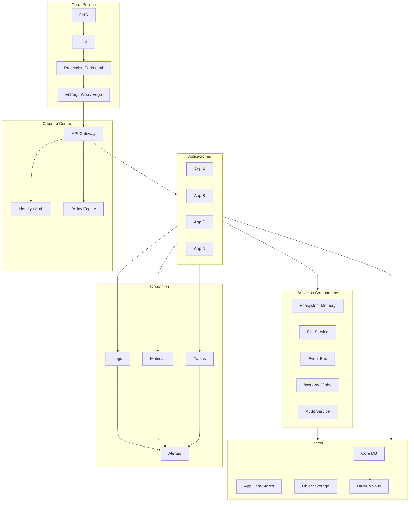
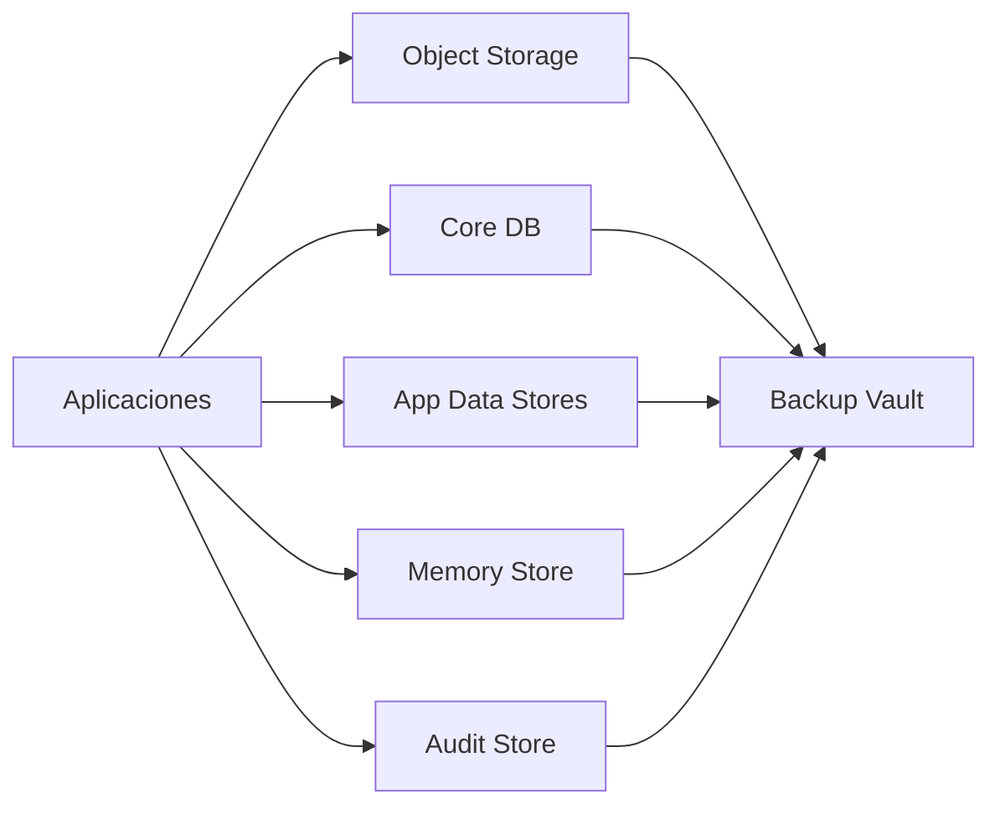
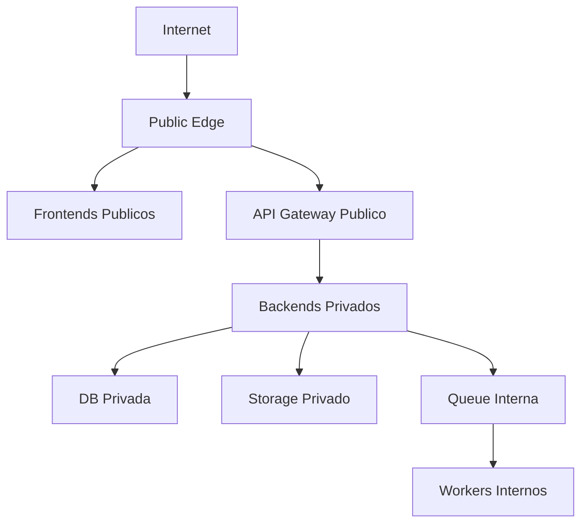
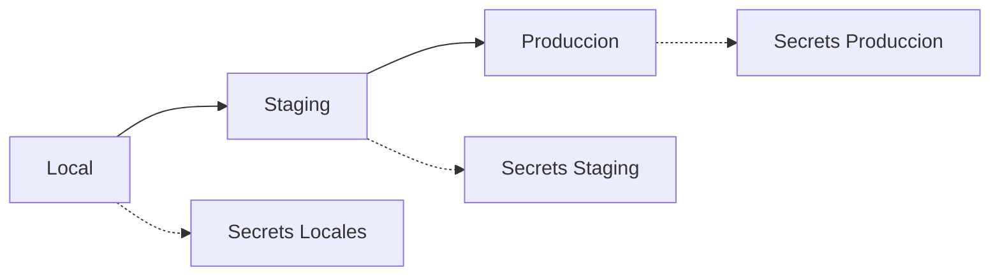
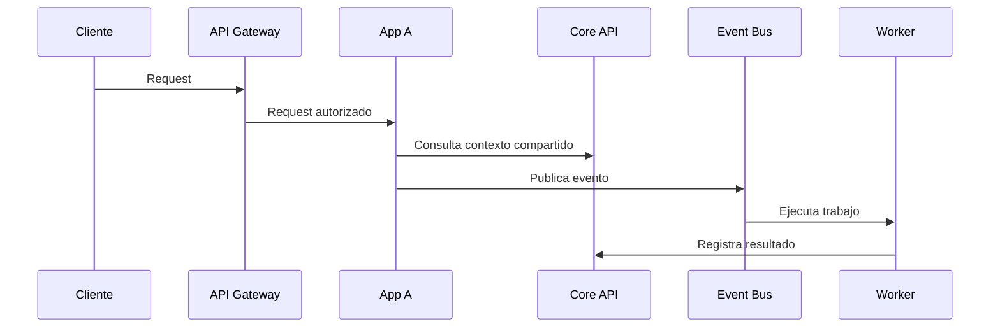

# 02 - Ecosystem Cloud Architecture

Estado: `ARCHITECTURE_REFERENCE`

Documento anterior: [01_INFRASTRUCTURE_FOUNDATION.md](./01_INFRASTRUCTURE_FOUNDATION.md)  
Documento siguiente: [03_ECOSYSTEM_DEPLOYMENT_ORDER.md](./03_ECOSYSTEM_DEPLOYMENT_ORDER.md)

## 1. Objetivo

Definir la arquitectura cloud logica del ecosistema sobre la fundacion establecida en [01_INFRASTRUCTURE_FOUNDATION.md](./01_INFRASTRUCTURE_FOUNDATION.md).

Este documento no selecciona proveedor cloud definitivo. Describe bloques, responsabilidades, limites y flujos para implementar la plataforma en el futuro.

## 2. Vista Ejecutiva

El ecosistema debe operar como una plataforma compuesta por:

- capa publica;
- capa de control;
- capa de aplicaciones;
- capa de servicios compartidos;
- capa de datos;
- capa de ejecucion asincronica;
- capa de observabilidad;
- capa de seguridad.



## 3. Capas de Arquitectura

### 3.1 Capa Publica

Responsabilidades:

- dominios;
- certificados TLS;
- cache de frontend cuando aplique;
- proteccion perimetral;
- reglas basicas de trafico;
- redireccion segura.

Decisiones pendientes:

- proveedor DNS;
- estrategia de subdominios;
- politica de certificados;
- reglas WAF.

### 3.2 Capa de Control

Incluye:

- API Gateway;
- identidad;
- permisos;
- policy engine;
- versionado;
- limites de consumo;
- auditabilidad.

El Gateway no debe contener logica de negocio profunda. Debe enrutar, proteger, auditar y normalizar.

### 3.3 Capa de Aplicaciones

Cada aplicacion debe poder desplegarse de forma independiente.

Contrato minimo por app:

- frontend;
- backend;
- health;
- readiness;
- runtime/status;
- version;
- variables requeridas;
- storage usado;
- base de datos usada;
- integraciones externas;
- runbook;
- rollback.

### 3.4 Capa de Servicios Compartidos

Servicios comunes:

- identidad;
- memoria del ecosistema;
- storage adapter;
- audit trail;
- event bus;
- workers;
- reportes;
- notificaciones futuras.

### 3.5 Capa de Datos

Datos separados por sensibilidad y dominio:

- core identity data;
- datos por aplicacion;
- datos de auditoria;
- memoria operativa;
- archivos;
- metricas historicas.



## 4. Red Logica

Modelo recomendado:

- frontends publicos;
- API Gateway publico controlado;
- backends privados cuando sea posible;
- bases de datos sin acceso publico directo;
- storage privado por defecto;
- jobs internos;
- observabilidad con acceso restringido.



## 5. Entornos

Entornos minimos:

1. Local.
2. Staging.
3. Produccion.

Reglas:

- staging debe parecerse a produccion;
- produccion no debe usar datos de prueba;
- local no debe depender de rutas absolutas;
- secrets deben ser distintos por entorno;
- migraciones deben probarse antes de produccion;
- cada deploy debe registrar commit y version.



## 6. Modelo de Aplicacion

Cada aplicacion debe declarar:

- nombre logico;
- owner;
- repositorio;
- rutas publicas;
- rutas internas;
- dependencias;
- variables;
- base de datos;
- storage;
- jobs;
- permisos;
- health checks;
- estrategia de rollback.

Formato sugerido:

```yaml
app:
  name: app-name
  owner: team-or-person
  frontend: true
  backend: true
  public_routes:
    - /
  api_routes:
    - /api/v1
  health:
    - /health
    - /runtime/status
  dependencies:
    - auth
    - storage
    - database
```

## 7. Comunicacion

Tres tipos:

1. Cliente a aplicacion: via frontend y API Gateway.
2. Aplicacion a aplicacion: via Internal API.
3. Trabajo asincronico: via eventos y workers.



## 8. Datos Compartidos

Datos compartidos permitidos:

- identidad;
- workspaces;
- permisos;
- auditoria;
- memoria operativa;
- entregables registrados;
- estado operacional de aplicaciones.

Datos no compartidos por defecto:

- credenciales;
- datos privados de clientes;
- documentos sensibles;
- secretos;
- datos financieros detallados;
- informacion tributaria sensible.

## 9. Seguridad Arquitectonica

Controles:

- segmentacion logica;
- minimo privilegio;
- tokens con alcance;
- rotacion de secrets;
- auditoria de acciones criticas;
- validacion backend;
- storage privado;
- logs sin secretos;
- rate limits;
- controles anti abuso.

## 10. Observabilidad Arquitectonica

Cada request debe tener:

- request_id;
- app;
- entorno;
- usuario si aplica;
- workspace si aplica;
- latencia;
- resultado;
- error normalizado si falla.

## 11. Riesgos

| Riesgo | Impacto | Mitigacion |
|---|---:|---|
| Aplicaciones aisladas sin core comun | Alto | Servicios compartidos obligatorios |
| Gateway sobrecargado con logica de negocio | Medio | Gateway solo routing/control |
| Bases expuestas publicamente | Critico | Red privada o acceso restringido |
| Eventos sin contrato | Alto | Versionado y schema de eventos |
| Entornos inconsistentes | Alto | Staging similar a produccion |

## 12. Dependencias

Depende de:

- [01_INFRASTRUCTURE_FOUNDATION.md](./01_INFRASTRUCTURE_FOUNDATION.md)

Habilita:

- [03_ECOSYSTEM_DEPLOYMENT_ORDER.md](./03_ECOSYSTEM_DEPLOYMENT_ORDER.md)
- [04_ECOSYSTEM_CONTROL_CENTER.md](./04_ECOSYSTEM_CONTROL_CENTER.md)
- [06_ECOSYSTEM_INTEGRATION_MAP.md](./06_ECOSYSTEM_INTEGRATION_MAP.md)

## 13. Auditoria Interna

Checklist:

- [x] Respeta fundacion cloud-agnostic.
- [x] No fija proveedor definitivo.
- [x] No crea recursos reales.
- [x] Define capas.
- [x] Define red logica.
- [x] Define entornos.
- [x] Define modelo por aplicacion.
- [x] Define comunicacion.
- [x] Define datos compartidos.
- [x] Incluye riesgos.
- [x] Enlaza con documentos previos y siguientes.

Contradicciones detectadas:

- Ninguna con el documento 01.

## 14. Recomendaciones

1. Implementar primero identidad, gateway y observabilidad antes de multiplicar apps.
2. Mantener backends privados siempre que la plataforma lo permita.
3. Evitar integraciones directas app-a-app sin Internal API o eventos.
4. Declarar manifiesto de infraestructura por cada nueva aplicacion.

