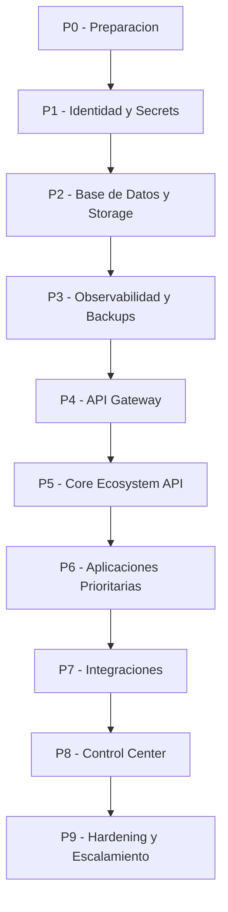
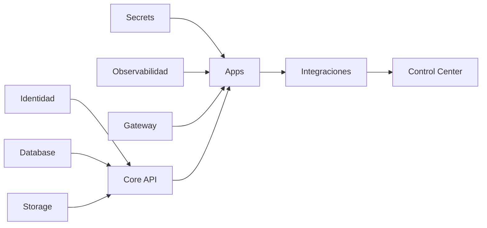

# 03 - Ecosystem Deployment Order

Estado: `DEPLOYMENT_SEQUENCE_REFERENCE`

Documento anterior: [02_ECOSYSTEM_CLOUD_ARCHITECTURE.md](./02_ECOSYSTEM_CLOUD_ARCHITECTURE.md)  
Documento siguiente: [04_ECOSYSTEM_CONTROL_CENTER.md](./04_ECOSYSTEM_CONTROL_CENTER.md)

## 1. Objetivo

Definir el orden logico de despliegue futuro del ecosistema, sin ejecutar deploy, sin crear recursos reales y sin modificar aplicaciones existentes.

El orden evita desplegar aplicaciones sobre una base incompleta.

## 2. Criterio de Orden

Una fase solo debe avanzar si la anterior tiene:

- health validado;
- secrets definidos;
- storage persistente si aplica;
- base de datos lista si aplica;
- logs minimos;
- backup si persiste datos;
- rollback documentado;
- smoke test.

## 3. Secuencia General

## 4. P0 - Preparacion

Objetivo:

Preparar repositorios, documentacion, entornos y criterios de validacion.

Entregables:

- inventario de aplicaciones;
- manifiesto de infraestructura por aplicacion;
- mapa de dependencias;
- lista de variables;
- estrategia de dominios;
- estrategia de entornos.

Validacion:

- no secrets en repositorios;
- cada app tiene owner;
- cada app tiene health previsto;
- cada app tiene rollback previsto.

## 5. P1 - Identidad y Secrets

Objetivo:

Crear la base de autenticacion, autorizacion y manejo seguro de secretos.

Incluye:

- auth service logico;
- roles;
- permisos;
- workspaces;
- tokens;
- variables por entorno;
- rotacion de secrets;
- politica de acceso.

No avanzar si:

- existe admin por defecto inseguro;
- existen secrets hardcodeados;
- permisos solo se validan en frontend;
- no hay separacion entre staging y produccion.

## 6. P2 - Base de Datos y Storage

Objetivo:

Establecer persistencia comun antes de conectar aplicaciones.

Incluye:

- base de datos principal;
- schemas o bases por app;
- migraciones;
- storage de archivos;
- metadata de archivos;
- memoria persistente;
- conexiones cifradas.

Validacion:

- conexion viva;
- migraciones aplicables;
- escritura y lectura;
- storage no efimero;
- permisos minimos.

## 7. P3 - Observabilidad y Backups

Objetivo:

Garantizar que cualquier app desplegada pueda ser monitoreada y recuperada.

Incluye:

- logs estructurados;
- metricas;
- alertas;
- health checks;
- backup automatico;
- restore test;
- runbook de incidentes.

No avanzar si:

- los backups no se pueden restaurar;
- health no alerta;
- logs exponen secrets;
- no existe monitoreo minimo.

## 8. P4 - API Gateway

Objetivo:

Centralizar entrada API y control de trafico.

Incluye:

- routing;
- rate limits;
- CORS;
- auth enforcement;
- rutas publicas;
- rutas internas;
- versionado.

Validacion:

- rutas publicas controladas;
- rutas internas no expuestas;
- errores normalizados;
- request_id en logs.

## 9. P5 - Core Ecosystem API

Objetivo:

Crear el nucleo comun de ecosistema.

Incluye:

- usuarios;
- roles;
- permisos;
- workspaces;
- apps registry;
- memoria operativa;
- auditoria;
- entregables;
- estado operacional.

Validacion:

- API documentada;
- permisos backend;
- auditoria activa;
- integracion con DB y storage;
- health y runtime/status.

## 10. P6 - Aplicaciones Prioritarias

Objetivo:

Desplegar aplicaciones de mayor valor sobre la base comun.

Orden recomendado por madurez:

1. Aplicaciones con produccion ya estable.
2. Aplicaciones con backend y frontend funcional.
3. Aplicaciones con dependencia baja.
4. Aplicaciones con mayor valor ejecutivo.
5. Aplicaciones experimentales al final.

Checklist por app:

- build PASS;
- tests PASS;
- health PASS;
- runtime/status PASS;
- storage persistente si aplica;
- secrets configurados;
- logs sin secrets;
- rollback documentado.

## 11. P7 - Integraciones

Objetivo:

Conectar aplicaciones entre si usando contratos.

Incluye:

- Internal API;
- eventos;
- webhooks internos;
- memoria compartida;
- entregables visibles;
- estado operacional compartido.

No avanzar si:

- una app lee datos privados de otra sin permisos;
- no hay versionado de eventos;
- no hay auditoria de integraciones.

## 12. P8 - Control Center

Objetivo:

Crear una vista central para operar el ecosistema.

Se detalla en [04_ECOSYSTEM_CONTROL_CENTER.md](./04_ECOSYSTEM_CONTROL_CENTER.md).

Incluye:

- apps activas;
- health;
- providers;
- backups;
- tareas;
- entregables;
- alertas;
- bloqueos;
- auditoria;
- costos futuros.

## 13. P9 - Hardening y Escalamiento

Objetivo:

Preparar el ecosistema para mayor carga, clientes y criticidad.

Incluye:

- CI/CD;
- entornos aislados;
- backups con restore automatico;
- rate limits avanzados;
- observabilidad end-to-end;
- seguridad reforzada;
- pruebas de carga;
- DR plan.

## 14. Diagrama de Dependencias

## 15. Riesgos

| Riesgo | Impacto | Mitigacion |
|---|---:|---|
| Desplegar apps antes de identidad | Alto | P1 obligatorio |
| Persistencia incompleta | Critico | P2 obligatorio |
| Sin backups antes de datos reales | Critico | P3 obligatorio |
| Integraciones prematuras | Alto | P7 despues de Core |
| Control Center sin fuentes confiables | Alto | P8 despues de integraciones |

## 16. Dependencias

Depende de:

- [01_INFRASTRUCTURE_FOUNDATION.md](./01_INFRASTRUCTURE_FOUNDATION.md)
- [02_ECOSYSTEM_CLOUD_ARCHITECTURE.md](./02_ECOSYSTEM_CLOUD_ARCHITECTURE.md)

Habilita:

- [04_ECOSYSTEM_CONTROL_CENTER.md](./04_ECOSYSTEM_CONTROL_CENTER.md)
- [05_ECOSYSTEM_EXECUTION_PLAN.md](./05_ECOSYSTEM_EXECUTION_PLAN.md)

## 17. Auditoria Interna

Checklist:

- [x] No ejecuta deploy.
- [x] No crea recursos reales.
- [x] Define orden de despliegue.
- [x] Protege contra apps sin base comun.
- [x] Incluye criterios de avance.
- [x] Incluye riesgos.
- [x] Es consistente con documentos 01 y 02.

Contradicciones detectadas:

- Ninguna.

## 18. Recomendaciones

1. No desplegar nuevas apps hasta cerrar identidad, storage, DB, backups y observabilidad.
2. Mantener la primera ola de apps limitada.
3. Cada app debe tener checklist PASS antes de entrar al ecosistema.
4. Control Center debe construirse despues de tener fuentes confiables.

