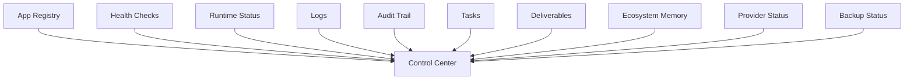
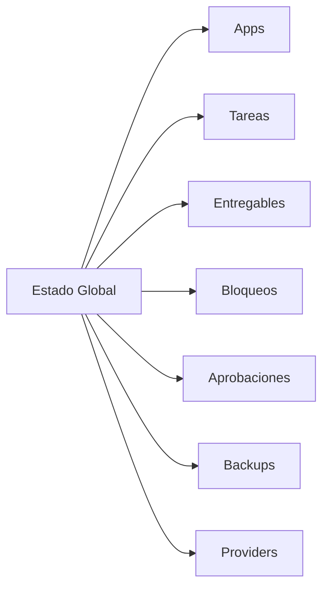
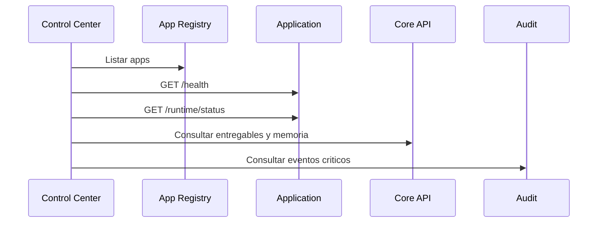

# 04 - Ecosystem Control Center

Estado: `CONTROL_CENTER_REFERENCE`

Documento anterior: [03_ECOSYSTEM_DEPLOYMENT_ORDER.md](./03_ECOSYSTEM_DEPLOYMENT_ORDER.md)  
Documento siguiente: [05_ECOSYSTEM_EXECUTION_PLAN.md](./05_ECOSYSTEM_EXECUTION_PLAN.md)

## 1. Objetivo

Definir el Control Center del ecosistema: la cabina ejecutiva y operativa que permite ver estado, salud, entregables, bloqueos, prioridades, alertas y dependencias de todas las aplicaciones.

Este documento no implementa UI, no modifica aplicaciones y no crea infraestructura.

## 2. Proposito Ejecutivo

El Control Center debe responder en menos de un minuto:

- que aplicaciones existen;
- cuales estan activas;
- cuales estan caidas;
- que esta construyendo cada app;
- que entregables existen;
- que bloqueos hay;
- que requiere aprobacion humana;
- que riesgos operativos existen;
- que integraciones estan funcionando;
- que backups estan sanos;
- que providers externos estan disponibles.

## 3. Fuentes de Datos

Fuentes minimas:

- registry de aplicaciones;
- `/health` por app;
- `/runtime/status` por app;
- logs agregados;
- auditoria;
- tareas;
- entregables;
- memoria del ecosistema;
- estado de providers;
- estado de backups;
- eventos de integracion.

## 4. Modelo de Informacion

Entidad: Application

Campos:

- app_id;
- nombre;
- owner;
- estado;
- entorno;
- frontend_url;
- backend_url;
- health_url;
- runtime_url;
- version;
- commit;
- ultima_validacion;
- dependencias;
- riesgos;

Entidad: OperationalStatus

- app_id;
- health;
- readiness;
- runtime;
- provider_state;
- storage_state;
- database_state;
- backup_state;
- alert_level;
- last_checked_at.

Entidad: Deliverable

- id;
- app_id;
- titulo;
- tipo;
- url;
- estado;
- creado_por;
- created_at;
- workspace_id;
- sensibilidad.

Entidad: Blocker

- id;
- app_id;
- descripcion;
- severidad;
- owner;
- estado;
- fecha_detectada;
- siguiente_accion.

## 5. Vista Ejecutiva

Bloques principales:

1. Estado global.
2. Aplicaciones activas.
3. Aplicaciones degradadas.
4. Prioridades.
5. Tareas activas.
6. Entregables recientes.
7. Bloqueos.
8. Aprobaciones humanas.
9. Backups.
10. Providers externos.

## 6. Vista Operativa

Debe mostrar:

- latencia por app;
- error rate;
- ultimos errores;
- colas;
- jobs;
- integraciones fallidas;
- eventos recientes;
- incidentes abiertos;
- deployments recientes.

## 7. Vista de Auditoria

Debe mostrar:

- cambios de permisos;
- cambios de configuracion;
- acciones criticas;
- ejecuciones de agentes;
- exportaciones;
- eliminaciones;
- cambios de provider;
- cambios de secretos sin mostrar valores.

## 8. Alertas

Severidades:

- INFO;
- WARNING;
- DEGRADED;
- CRITICAL;
- BLOCKED.

Reglas iniciales:

- health fail => CRITICAL;
- storage no persistente en produccion => CRITICAL;
- provider principal down => DEGRADED;
- backup fallido => CRITICAL;
- cola acumulada => WARNING o DEGRADED;
- errores 5xx elevados => DEGRADED;
- secrets expuestos => CRITICAL.

## 9. Aprobaciones Humanas

Acciones que deben requerir aprobacion:

- deploy a produccion;
- push automatico;
- eliminacion de datos;
- rotacion de secrets;
- cambios de permisos elevados;
- ejecucion de tareas con escritura;
- acciones financieras, tributarias o legales;
- integraciones que transmiten datos sensibles.

## 10. Comunicacion con Aplicaciones

El Control Center no debe leer bases de datos de apps directamente salvo contrato aprobado.

Debe consumir:

- App Registry;
- Core API;
- endpoints de status;
- eventos;
- auditoria central;
- memoria del ecosistema.

## 11. Mobile

La vista mobile debe priorizar:

1. Estado global.
2. Bloqueos criticos.
3. Aprobaciones pendientes.
4. Chat ejecutivo futuro si aplica.
5. Apps degradadas.

No debe intentar mostrar todos los paneles de escritorio.

## 12. Seguridad

Reglas:

- acceso solo a usuarios autorizados;
- datos sensibles con mascara;
- secrets nunca visibles;
- acciones criticas auditadas;
- permisos backend;
- sesiones con expiracion;
- logs del Control Center centralizados.

## 13. Riesgos

| Riesgo | Impacto | Mitigacion |
|---|---:|---|
| Mostrar datos falsos por falta de fuentes | Alto | Fuentes oficiales y timestamps |
| Control Center con acceso excesivo | Critico | Permisos minimos |
| Sin auditoria de acciones | Alto | Audit Trail obligatorio |
| Alertas ruidosas | Medio | Severidades y deduplicacion |
| Mobile saturado | Medio | Priorizacion ejecutiva |

## 14. Dependencias

Depende de:

- [01_INFRASTRUCTURE_FOUNDATION.md](./01_INFRASTRUCTURE_FOUNDATION.md)
- [02_ECOSYSTEM_CLOUD_ARCHITECTURE.md](./02_ECOSYSTEM_CLOUD_ARCHITECTURE.md)
- [03_ECOSYSTEM_DEPLOYMENT_ORDER.md](./03_ECOSYSTEM_DEPLOYMENT_ORDER.md)

Habilita:

- [05_ECOSYSTEM_EXECUTION_PLAN.md](./05_ECOSYSTEM_EXECUTION_PLAN.md)
- [06_ECOSYSTEM_INTEGRATION_MAP.md](./06_ECOSYSTEM_INTEGRATION_MAP.md)

## 15. Auditoria Interna

Checklist:

- [x] No implementa UI.
- [x] No modifica apps.
- [x] Define fuentes.
- [x] Define entidades.
- [x] Define vista ejecutiva.
- [x] Define vista operativa.
- [x] Define auditoria.
- [x] Define alertas.
- [x] Define aprobaciones humanas.
- [x] Es consistente con documentos 01, 02 y 03.

Contradicciones detectadas:

- Ninguna.

## 16. Recomendaciones

1. No construir Control Center hasta tener App Registry y runtime/status estables.
2. Mostrar siempre timestamp y fuente de cada dato critico.
3. Separar vista ejecutiva de vista tecnica.
4. Evitar permisos globales salvo para administradores reales.

