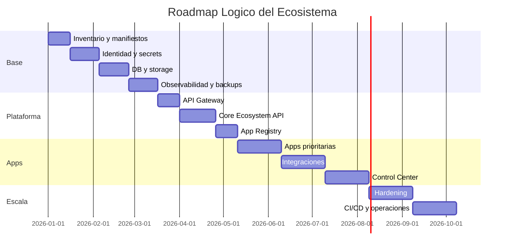

# 05 - Ecosystem Execution Plan

Estado: `EXECUTION_PLAN_REFERENCE`

Documento anterior: [04_ECOSYSTEM_CONTROL_CENTER.md](./04_ECOSYSTEM_CONTROL_CENTER.md)  
Documento siguiente: [06_ECOSYSTEM_INTEGRATION_MAP.md](./06_ECOSYSTEM_INTEGRATION_MAP.md)

## 1. Objetivo

Definir el plan de ejecucion futuro para implementar el ecosistema cloud sin asumir proveedor definitivo y sin crear recursos reales en esta fase.

Este documento convierte la arquitectura de los documentos 01 a 04 en una secuencia accionable.

## 2. Regla de Ejecucion

Cada fase futura debe seguir:

1. Preparar.
2. Implementar.
3. Validar.
4. Auditar.
5. Corregir.
6. Documentar.
7. Avanzar.

No se debe marcar una fase como completa sin evidencia.

## 3. Roadmap General

Las fechas son ilustrativas y no representan compromiso de calendario.

## 4. Fase A - Preparacion Operativa

Objetivo:

Crear inventario real y manifiestos por aplicacion.

Entregables:

- App Registry inicial;
- manifiesto por app;
- mapa de dependencias;
- variables por entorno;
- checklist de seguridad;
- criterio de readiness.

Validacion:

- todas las apps tienen owner;
- todas las apps declaran health;
- ningun manifiesto contiene secrets;
- dependencias documentadas.

## 5. Fase B - Identidad y Seguridad

Objetivo:

Construir identidad compartida y politica de acceso.

Entregables:

- modelo usuario/workspace/rol/permiso;
- politicas RBAC;
- tokens;
- sesiones;
- secrets por entorno;
- auditoria de accesos.

Criterio de salida:

- login funcional;
- permisos backend;
- no admin default inseguro;
- secrets fuera de repo;
- logs sin secrets.

## 6. Fase C - Persistencia

Objetivo:

Establecer datos y archivos persistentes.

Entregables:

- base de datos;
- migraciones;
- storage;
- memoria persistente;
- metadata de archivos;
- backup inicial.

Criterio de salida:

- escritura y lectura PASS;
- migraciones PASS;
- storage no efimero;
- backup generado;
- restore probado.

## 7. Fase D - Observabilidad

Objetivo:

Hacer que el ecosistema sea operable.

Entregables:

- logs estructurados;
- metricas;
- trazas si aplica;
- alertas;
- dashboards operativos;
- runbooks.

Criterio de salida:

- health alertable;
- errores visibles;
- request_id trazable;
- backup falla y alerta;
- proveedor externo falla y alerta.

## 8. Fase E - Gateway y Core

Objetivo:

Centralizar entrada y servicios compartidos.

Entregables:

- API Gateway;
- Core Ecosystem API;
- App Registry;
- Audit Service;
- Memory Service;
- File Service;
- Event Bus basico.

Criterio de salida:

- rutas protegidas;
- rutas internas no expuestas;
- Core API documentada;
- eventos versionados;
- audit trail activo.

## 9. Fase F - Apps Prioritarias

Objetivo:

Subir aplicaciones maduras al ecosistema comun.

Checklist por app:

- build PASS;
- tests PASS;
- health PASS;
- runtime/status PASS;
- secrets configurados;
- storage persistente si aplica;
- DB conectada si aplica;
- logs activos;
- rollback documentado;
- smoke test live.

Orden interno:

1. Apps ya estables.
2. Apps con menor dependencia.
3. Apps con mayor valor ejecutivo.
4. Apps experimentales.

## 10. Fase G - Integraciones

Objetivo:

Conectar aplicaciones con contratos y eventos.

Entregables:

- mapa de integraciones;
- contratos API;
- contratos de eventos;
- permisos inter-app;
- trazabilidad;
- pruebas end-to-end.

Criterio de salida:

- no acceso directo no autorizado;
- eventos idempotentes;
- errores con retry controlado;
- auditoria de integracion.

## 11. Fase H - Control Center

Objetivo:

Crear cabina central del ecosistema.

Depende de [04_ECOSYSTEM_CONTROL_CENTER.md](./04_ECOSYSTEM_CONTROL_CENTER.md).

Entregables:

- vista ejecutiva;
- vista operativa;
- apps activas;
- bloqueos;
- entregables;
- alertas;
- aprobaciones;
- backups;
- providers.

Criterio de salida:

- datos con fuente y timestamp;
- mobile usable;
- permisos backend;
- acciones criticas auditadas.

## 12. Fase I - Hardening

Objetivo:

Preparar escalamiento y operacion estable.

Entregables:

- CI/CD;
- staging/production isolation;
- pruebas de carga;
- seguridad reforzada;
- restore automatico;
- DR plan;
- monitoreo avanzado;
- costos y capacidad.

## 13. Matriz de Decision

| Area | Gate minimo para avanzar |
|---|---|
| Seguridad | Secrets fuera de repo y permisos backend |
| Datos | Escritura, lectura, migraciones y backup |
| Apps | Build, tests, health, runtime |
| Observabilidad | Logs, alertas, request_id |
| Integracion | Contratos y auditoria |
| Operacion | Rollback y runbook |

## 14. Riesgos

| Riesgo | Impacto | Mitigacion |
|---|---:|---|
| Saltar fases base | Critico | Gates obligatorios |
| Marcar completado sin evidencia | Alto | Checklist y reportes |
| Integrar apps inmaduras | Alto | Orden por madurez |
| Control Center con fuentes incompletas | Alto | App Registry y runtime/status antes |
| Cloud lock-in prematuro | Medio | Adapters y cloud-agnostic |

## 15. Dependencias

Depende de:

- [01_INFRASTRUCTURE_FOUNDATION.md](./01_INFRASTRUCTURE_FOUNDATION.md)
- [02_ECOSYSTEM_CLOUD_ARCHITECTURE.md](./02_ECOSYSTEM_CLOUD_ARCHITECTURE.md)
- [03_ECOSYSTEM_DEPLOYMENT_ORDER.md](./03_ECOSYSTEM_DEPLOYMENT_ORDER.md)
- [04_ECOSYSTEM_CONTROL_CENTER.md](./04_ECOSYSTEM_CONTROL_CENTER.md)

Habilita:

- [06_ECOSYSTEM_INTEGRATION_MAP.md](./06_ECOSYSTEM_INTEGRATION_MAP.md)

## 16. Auditoria Interna

Checklist:

- [x] No ejecuta implementacion real.
- [x] No modifica aplicaciones.
- [x] Convierte arquitectura en fases.
- [x] Incluye criterios de salida.
- [x] Incluye riesgos.
- [x] Mantiene orden del documento 03.
- [x] Es consistente con Control Center del documento 04.

Contradicciones detectadas:

- Ninguna.

## 17. Recomendaciones

1. Ejecutar primero inventario real antes de cualquier infraestructura.
2. No permitir apps sin runtime/status dentro del Control Center.
3. Usar gates de evidencia para evitar avances inflados.
4. Mantener el roadmap vivo y versionado.

