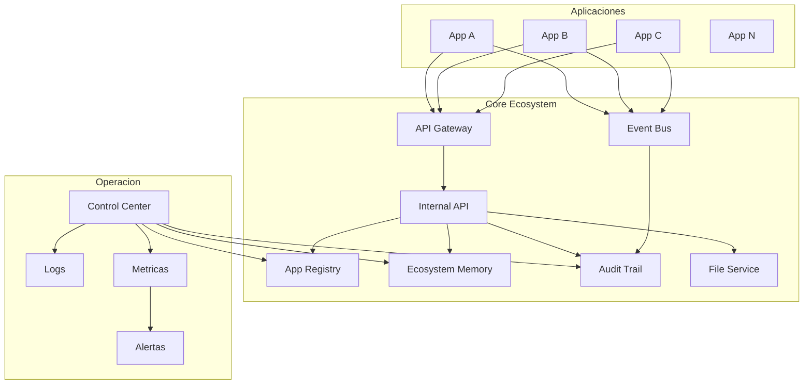
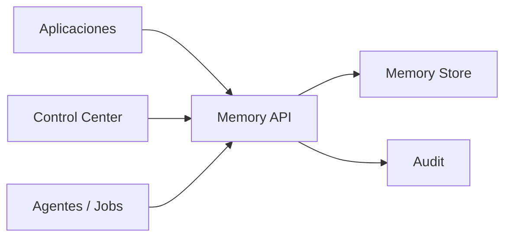
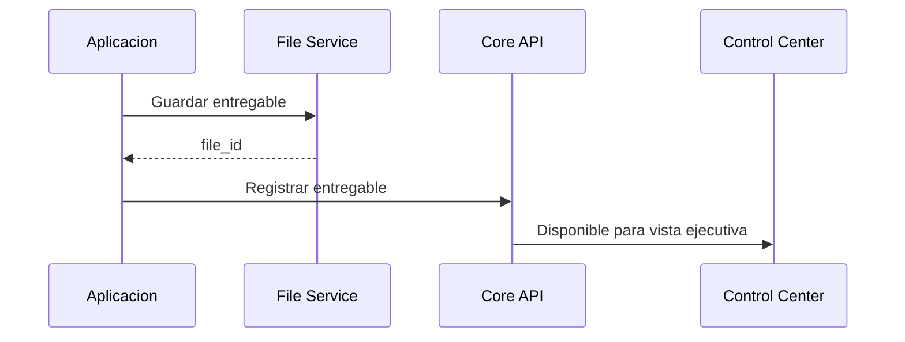

# 06 - Ecosystem Integration Map

Estado: `INTEGRATION_MAP_REFERENCE`

Documento anterior: [05_ECOSYSTEM_EXECUTION_PLAN.md](./05_ECOSYSTEM_EXECUTION_PLAN.md)  
Documento siguiente: ninguno

## 1. Objetivo

Definir el mapa de integracion del ecosistema para conectar aplicaciones, servicios compartidos, datos, eventos, memoria, entregables y Control Center sin acoplamiento inseguro.

Este documento no conecta servicios reales, no modifica aplicaciones y no crea infraestructura.

## 2. Principio Central

Las aplicaciones no deben integrarse mediante accesos improvisados a bases de datos ajenas ni dependencias directas no documentadas.

Toda integracion debe usar:

- API publica via Gateway;
- API interna versionada;
- evento versionado;
- memoria del ecosistema;
- registry;
- audit trail.

## 3. Mapa General



## 4. Tipos de Integracion

### 4.1 Sincronica

Uso:

- consultas inmediatas;
- acciones del usuario;
- lectura de estado;
- validaciones.

Canal:

- API Gateway para cliente;
- Internal API para backend.

Riesgo:

- acoplamiento fuerte si se abusa.

Mitigacion:

- timeouts;
- retries limitados;
- contratos versionados.

### 4.2 Asincronica

Uso:

- jobs;
- entregables;
- procesamiento largo;
- notificaciones;
- sincronizacion de memoria;
- auditoria.

Canal:

- Event Bus / Queue.

Riesgo:

- eventos perdidos o duplicados.

Mitigacion:

- idempotencia;
- event_id;
- retries;
- dead-letter queue futura.

### 4.3 Contextual

Uso:

- memoria del ecosistema;
- estado de proyectos;
- prioridades;
- bloqueos;
- decisiones.

Canal:

- Ecosystem Memory.

Riesgo:

- informacion desactualizada.

Mitigacion:

- timestamp;
- fuente;
- confidence;
- auditoria.

## 5. Contratos API

Toda API interna debe declarar:

- owner;
- version;
- autenticacion;
- permisos;
- request schema;
- response schema;
- errores;
- rate limits;
- cambios incompatibles.

Formato minimo:

```yaml
api_contract:
  name: app-status
  version: v1
  owner: ecosystem-core
  auth: required
  permissions:
    - ecosystem.status.read
  endpoint: /api/internal/v1/apps/{app_id}/status
  response:
    app_id: string
    health: string
    runtime: string
    updated_at: string
```

## 6. Contratos de Eventos

Formato minimo:

```json
{
  "event_id": "uuid",
  "event_type": "app.resource.changed",
  "version": "1.0",
  "source_app": "app-name",
  "workspace_id": "workspace-id",
  "created_at": "ISO-8601",
  "payload": {}
}
```

Reglas:

- event_id obligatorio;
- version obligatoria;
- source_app obligatorio;
- payload validado;
- no secrets;
- no datos sensibles innecesarios;
- eventos criticos auditados.

## 7. Integracion con Memoria

La memoria del ecosistema debe recibir:

- decisiones;
- prioridades;
- bloqueos;
- entregables;
- estado de aplicaciones;
- auditorias relevantes;
- cambios de fase;
- resultados de tareas.



Cada entrada de memoria debe tener:

- id;
- tipo;
- fuente;
- timestamp;
- contenido;
- app_id si aplica;
- workspace_id si aplica;
- sensibilidad;
- version.

## 8. Integracion con Entregables

Los entregables no deben quedar dispersos.

Flujo:



Metadata minima:

- deliverable_id;
- titulo;
- app_id;
- file_id;
- tipo;
- owner;
- created_at;
- estado;
- sensibilidad.

## 9. Integracion con Control Center

Control Center debe consumir:

- App Registry;
- health;
- runtime/status;
- entregables;
- bloqueos;
- tareas;
- memoria;
- auditoria;
- providers;
- backups.

No debe:

- leer secrets;
- modificar datos sin permiso;
- saltarse APIs oficiales;
- presentar datos sin timestamp.

## 10. Integracion con Agentes y Workers

Los agentes deben operar con:

- token propio;
- permisos minimos;
- cola de tareas;
- heartbeat;
- logs;
- snapshot antes de modificar;
- backup antes de modificar;
- resultado registrado;
- aprobacion humana para acciones criticas.

No deben:

- hacer push automatico sin aprobacion;
- hacer deploy automatico sin aprobacion;
- exponer secrets;
- borrar datos sin rollback.

## 11. Matriz de Integracion

| Fuente | Destino | Canal | Sincrono | Auditoria |
|---|---|---|---:|---:|
| Frontend | API Gateway | HTTPS | Si | Parcial |
| App Backend | Core API | Internal API | Si | Si |
| App Backend | Event Bus | Evento | No | Si |
| Worker | Core API | Internal API | Si | Si |
| App | File Service | API | Si | Si |
| App | Memory API | API/Event | Mixto | Si |
| Control Center | App Status | Status API | Si | Si |

## 12. Seguridad de Integraciones

Controles:

- tokens por servicio;
- scopes por app;
- permisos por workspace;
- mTLS futuro si aplica;
- rate limits internos;
- audit trail;
- schema validation;
- no secrets en eventos;
- redaccion de datos sensibles.

## 13. Riesgos

| Riesgo | Impacto | Mitigacion |
|---|---:|---|
| Integraciones directas a DB ajena | Critico | Internal API obligatorio |
| Eventos sin version | Alto | Schema y version requeridos |
| Datos sensibles en eventos | Critico | Redaccion y politicas |
| Control Center con datos stale | Medio | Timestamp y freshness |
| Agentes con permisos excesivos | Critico | Scopes y aprobacion humana |

## 14. Dependencias

Depende de:

- [01_INFRASTRUCTURE_FOUNDATION.md](./01_INFRASTRUCTURE_FOUNDATION.md)
- [02_ECOSYSTEM_CLOUD_ARCHITECTURE.md](./02_ECOSYSTEM_CLOUD_ARCHITECTURE.md)
- [03_ECOSYSTEM_DEPLOYMENT_ORDER.md](./03_ECOSYSTEM_DEPLOYMENT_ORDER.md)
- [04_ECOSYSTEM_CONTROL_CENTER.md](./04_ECOSYSTEM_CONTROL_CENTER.md)
- [05_ECOSYSTEM_EXECUTION_PLAN.md](./05_ECOSYSTEM_EXECUTION_PLAN.md)

## 15. Auditoria Interna

Checklist:

- [x] No conecta servicios reales.
- [x] No modifica aplicaciones.
- [x] Define tipos de integracion.
- [x] Define contratos API.
- [x] Define eventos.
- [x] Define memoria.
- [x] Define entregables.
- [x] Define Control Center.
- [x] Define agentes.
- [x] Incluye matriz.
- [x] Incluye riesgos.
- [x] Es consistente con documentos 01 a 05.

Contradicciones detectadas:

- Ninguna.

## 16. Recomendaciones

1. Crear contratos antes de integrar aplicaciones.
2. Prohibir accesos directos a bases de datos de otras apps.
3. Centralizar entregables y memoria para que el Control Center tenga fuentes confiables.
4. Usar eventos solo cuando haya idempotencia y auditoria.
5. Mantener permisos por servicio y por workspace.

