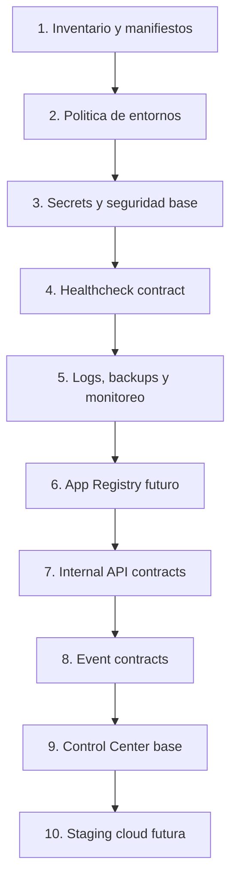

# 08 - Ecosystem Critical Path

Estado: `CRITICAL_PATH_DEFINED`

Fuente:

- [07_ECOSYSTEM_IMPLEMENTATION_BACKLOG.md](./07_ECOSYSTEM_IMPLEMENTATION_BACKLOG.md)

## 1. Objetivo

Definir la ruta minima para tener el ecosistema listo para nube sin tocar FORJA, sin tocar CEREBRO y sin crear infraestructura real en esta fase.

## 2. Secuencia Minima

## 3. Bloqueos Criticos

| Bloqueo | Severidad | Estado | Salida |
|---|---:|---|---|
| No hay repositorio Git detectado | Alta | Resuelto | Git inicializado localmente; documentacion versionada en `997962e` |
| No hay inventario real de apps en este workspace | Media | Controlado | App Registry V1 inicializado; falta primer manifest aprobado con evidencia real |
| No hay stack aplicativo en este workspace | Media | Activo | Mantener fase documental hasta seleccionar repo real |
| No hay proveedor cloud definitivo | Baja | Aceptado | Mantener arquitectura cloud-agnostic |

## 4. Tareas Paralelizables

Se pueden trabajar en paralelo:

- definicion de variables por entorno;
- checklist de seguridad;
- contratos de healthcheck;
- convenciones de logs;
- convenciones de backups;
- convenciones de monitoreo;
- contratos de API internos;
- contratos de eventos;
- formatos de entregables.

No se deben paralelizar todavia:

- integracion con apps reales;
- despliegues;
- cambios en FORJA;
- cambios en CEREBRO;
- provisionamiento cloud.

## 5. Tareas que Dependen de FORJA

No ejecutar sin aprobacion:

- conectar runtime/status de FORJA;
- leer memoria productiva de FORJA;
- registrar entregables reales de FORJA;
- crear tareas de agente para FORJA;
- modificar endpoints de FORJA.

Si se requiere tocar FORJA, detenerse y reportar archivo, motivo, riesgo y alternativa.

## 6. Tareas que Dependen de CEREBRO

No ejecutar sin aprobacion:

- conectar Human Cabin de CEREBRO al Control Center;
- consumir conversaciones persistentes de CEREBRO;
- modificar storage de CEREBRO;
- cambiar UI de CEREBRO;
- cambiar endpoints productivos de CEREBRO.

Si se requiere tocar CEREBRO, detenerse y reportar archivo, motivo, riesgo y alternativa.

## 7. Tareas Ejecutables Sin FORJA ni CEREBRO

Ejecutadas:

- documentar diagnostico del workspace;
- crear plantillas de entornos;
- crear checklist de seguridad;
- crear contrato de healthcheck;
- crear convenciones de logs;
- crear convenciones de backups;
- crear convenciones de monitoreo;
- crear backlog ejecutable;
- crear contratos del Control Center;
- crear contratos de integracion.
- inicializar App Registry V1;
- crear plantilla de manifest por aplicacion;
- validar registry documental.

## 8. Ruta Cloud-Ready Minima

Para que el ecosistema este listo para una futura implementacion cloud:

1. Repositorio Git real local inicializado.
2. App Registry inicial.
3. Primer manifest por app con evidencia real.
4. Politica de entornos aprobada.
5. Secrets fuera del repo.
6. Health/runtime contract aplicado por app.
7. Storage persistente definido.
8. Backup y restore definidos.
9. Logs y monitoreo definidos.
10. Contratos internos versionados.
11. Control Center con fuentes oficiales.

## 9. Auditoria Interna

- [x] Define secuencia minima.
- [x] Lista bloqueos criticos.
- [x] Lista tareas paralelizables.
- [x] Lista tareas dependientes de FORJA.
- [x] Lista tareas dependientes de CEREBRO.
- [x] Lista tareas seguras sin tocar apps.
- [x] No modifica aplicaciones.
- [x] No crea recursos cloud.

## 10. Recomendacion

Siguiente paso tecnico real:

Crear `FIRST_APP_MANIFEST_V1` para la primera aplicacion autorizada, usando el template versionado y evidencia real.
