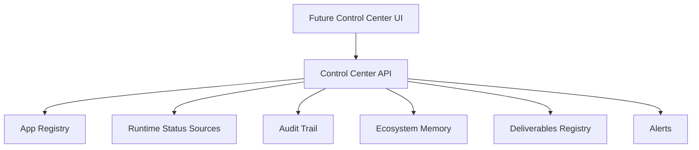

# Control Center

Estado: `BLOCK_1_PREMIUM_API_IMPLEMENTED`

## 1. Objetivo

Preparar y operar la base local del CONTROL CENTER sin conectar aplicaciones
sensibles ni tocar FORJA, CEREBRO o DCFT.

## 2. Alcance

El CONTROL CENTER debe operar como cabina central para:

- estado global;
- aplicaciones activas;
- health;
- runtime/status;
- entregables;
- bloqueos;
- aprobaciones;
- backups;
- providers;
- auditoria.

## 3. Estructura Tecnica

## 4. Fuentes Permitidas

- App Registry.
- Core API.
- Health endpoints.
- Runtime/status endpoints.
- Audit Trail.
- Memory API.
- Deliverables Registry.
- Backup Status.

## 5. Fuentes Prohibidas sin Aprobacion

- Bases de datos privadas de aplicaciones.
- Secrets.
- Repositorios externos.
- FORJA.
- CEREBRO.

## 6. Endpoints Implementados

- `GET /api/v1/control-center`
- `GET /api/v1/control-center/overview`
- `GET /api/v1/control-center/status`
- `GET /api/v1/control-center/apps`
- `GET /api/v1/control-center/services`
- `GET /api/v1/control-center/dependencies`
- `GET /api/v1/control-center/metrics`
- `GET /api/v1/control-center/alerts`
- `GET /api/v1/control-center/readiness`

## 7. Estado

El Block 1 implementa API runtime local con:

- vista CEO;
- vista operativa;
- consolidacion de App Registry;
- consolidacion de Storage/Database;
- servicios internos;
- dependencias;
- metricas;
- alertas;
- readiness;
- audit trail local del Control Center.

Las conexiones reales con aplicaciones externas siguen deshabilitadas.
