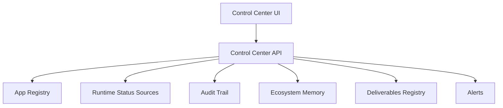

# Control Center Base

Estado: `BASE_DEFINED`

## 1. Objetivo

Preparar la base documental del CONTROL CENTER sin conectar aplicaciones sensibles y sin crear UI o backend real.

## 2. Alcance

El CONTROL CENTER debe operar como cabina central para:

- estado global;
- aplicaciones activas;
- health;
- runtime/status;
- entregables;
- bloqueos;
- aprobaciones;
- backups;
- providers;
- auditoria.

## 3. Estructura Tecnica Futura

## 4. Fuentes Permitidas

- App Registry.
- Core API.
- Health endpoints.
- Runtime/status endpoints.
- Audit Trail.
- Memory API.
- Deliverables Registry.
- Backup Status.

## 5. Fuentes Prohibidas sin Aprobacion

- Bases de datos privadas de aplicaciones.
- Secrets.
- Repositorios externos.
- FORJA.
- CEREBRO.

## 6. Estado

Solo se crea base documental.

No hay implementacion runtime.

